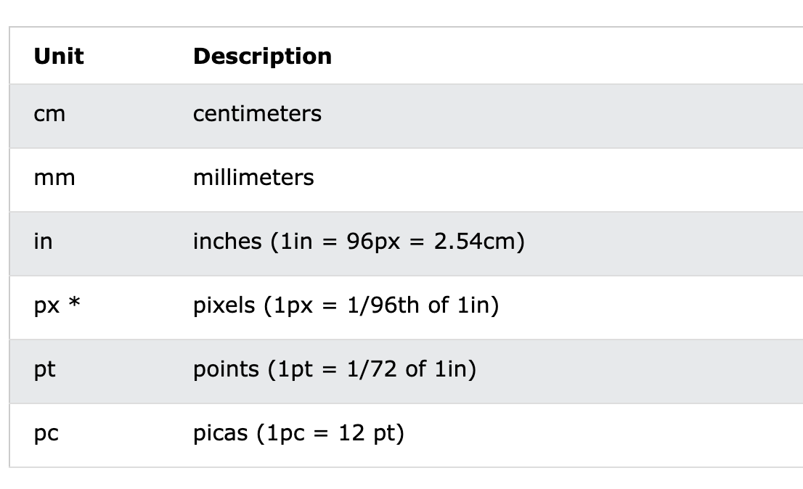
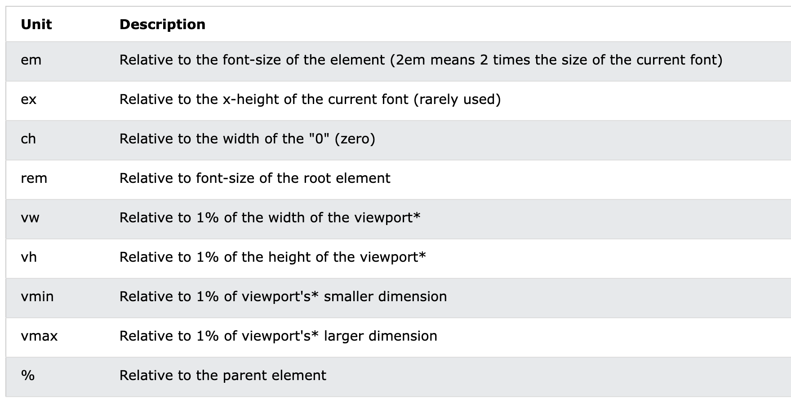
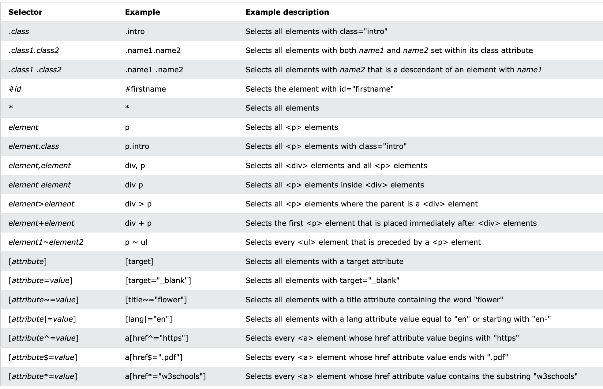
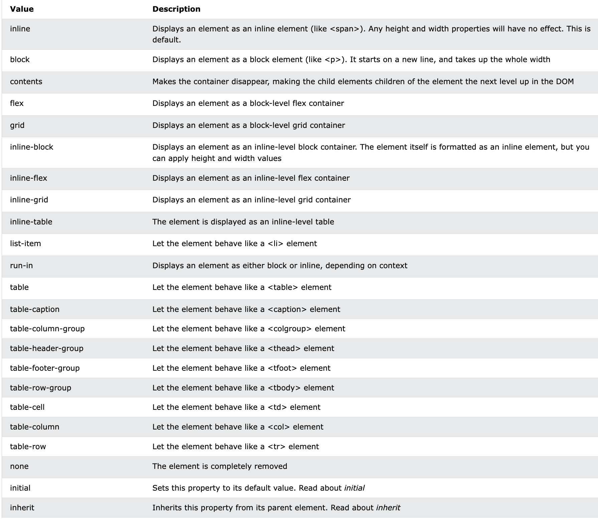
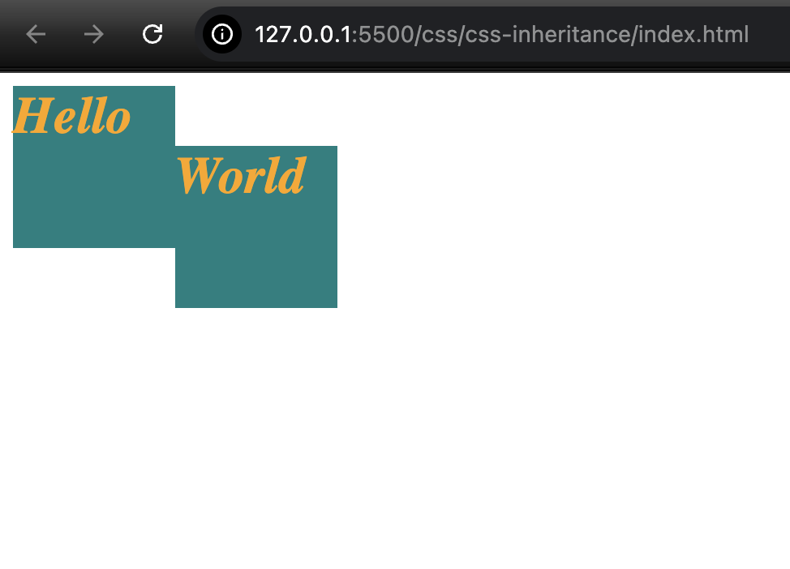
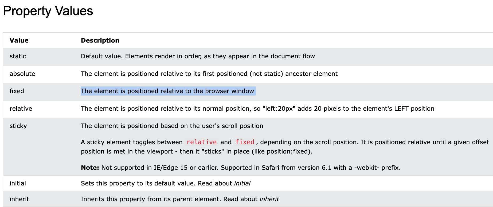

## Resources:

[fontawesome](https://fontawesome.com/): For fonts and emojis.  
[pexels](https://pexels.com/): For free images and videos.  
[w3schools](https://www.w3schools.com/css/): For learning CSS.  
[Codepip](https://codepip.com/games/): Games to play for learning flexbox and CSS grid.


## Types of CSS:
1 - Inline CSS  
2 - Internal CSS  
3 - External CSS  

## Colors
1 - Colors Name  
2 - RGB  
3 - HEX  

## Units:
There are two types of length units: absolute and relative.
### Absolute Units


### Relative Units


## Font formatting in CSS

`font-family: sans-serif;`  
`font-size: 20px;`  
`text-transform: capitalize;`  
`line-height: 20px; [space between two lines]`  
`letter-spacing: 5px; [space between two characters]`  
`word-spacing: 10px; [space between two words]`  
`text-align: center;`  
`text-decoration: underline;`  
`cursor: auto;`  
`font-weight: bold;`  

For using more fonts: https://fonts.google.com

## Box model

### Border
`border-width: 20px;`  
`border-styled: dotted;`  
`border-color: red;`  
`border: 10px dotted teal;`  
`border-right: 10px dotted teal;`  
`border-left: 10px dotted teal;`  
`border-top: 10px dotted teal;`  
`border-bottom: 10px dotted teal;`  

### Padding
`padding-left: 10px`  
`padding-right: 10px`  
`padding-top: 10px`  
`padding-bottom: 10px`  
`padding: 10px 20px; [10px for top and bottom, 20px for left and right]`  

### Margin
`margin: 10px;`  
`margin-left: 10px;`  
`margin-right: 10px;`  
`margin-top: 10px;`  
`margin-bottom: 10px;`  

### Background Properties
`background-color: green;`  
`background-image: url("img1");`  
`background-repeat: no-repeat;`  
`background-size: cover;`  
`background-position: bottom;`  
`background-attachment: fixed;`   

## Gradient in CSS
There are two types of gradient linear and radial.

`background-image: liner-gradient(to bottom, rgba(..), rgba(..)), url(...);`

`background-image: radial-gradient(blue, skyblue), url(...);`


## Filters

`filter: blur(10px);`  
`filter: brightness(50%);`  
for more info: https://www.w3schools.com/cssref/css3_pr_filter.php

## Advance Selector in CSS

### class selector

### id selector  

### Everything selector  
`select everything in html`
```
* {
    border: 2px solid red;
  }
```
<br>

`select everthing inside the section`
```
section * {
    border: 2px solid teal;
}
```
<br>

`Element class selector`
```
<div>This is sample div</div>
<div class='text'> This is text class div </div>


div.text{
    color: teal;
}

This selector will select the div which have class text.
```

`List of all CSS selectors`


## Display Property in CSS

`Inline`: It does not take height and width
example: span, img etc.

`Block`: Displays an element as a block element. It starts on a new line, and takes up the whole width.

`inline-block`: Display an element as inline-level block container.

`none`: Element is completely remove from DOM.

`List of all different kind of display properties`



## Using Fonts

Go to `fontawesome.com `and search for respective icon and add it's html in the code.
And also add cdn stylesheet link of font awesome from `cdnjs.com`.


## Box Shadow

`index.html`
```
<!DOCTYPE html>
<html>
    <head>
        <link rel="stylesheet" href="style.css">
    </head>
    <body>
        <div></div>
    </body>
</html>
```

`style.css`
```
/* x y blurness color*/
div{
    width:200px;
    height:200px;
    background:rgb(105, 105, 205);
    box-shadow: 15px 10px 4px orange;
}
```

## CSS Inheritance

Inheritance is when we declare something on an element, and it also applies that element's decendant.

CSS inheritance is only applied to typograph related properties to its child and not for layout related properties.  

`index.html`
```
<!DOCTYPE html>
<html>
    <head>
        <link rel="stylesheet" href="style.css">
    </head>
    <body>
        <div class="parent">
            Hello
            <div class="children">World</div>
        </div>
    </body>
</html>

```
`style.css`
```
/*Layout properties are not implicit inherit by children, required to use inherit keyword.*/
.parent{
    font-family: Cambria;
    font-weight: bold;
    font-style: italic;
    font-size: 2rem;
    color: orange;
    width: 100px;
    height: 100px;
    background-color: teal;
}

.children{
    position: relative;
    left: 100px;
    width: inherit;
    height: inherit;
    background-color: inherit;
}
```



## CSS positions

In position relative element is not leaving its position.
Whereas in position absolute, element is leaving its position.

Fixed: The element is positioned relative to the browser window	





## Flexbox

`display: flex`  

This properties work on main axis.  
`flex-direction: column` [default: row]  
`flex-wrap: wrap`  
`justify-content: center;`  

This properties work on cross axis.  
`flex-wrap: wrap`  
`align-content: space-between;` [align-content works with flex-wrap not a standalone.]

This properties work on single items.  
`order: 1;`  
`align-self: center;`  
`flex-grow: 1;` [default 0]  
`flex-basis: 10px;`  
`flex-shrink:4;`

Note:  
1 - The two properties `flex-direction` and `flex-wrap` are used so often together that the shorthand property `flex-flow` was created to combine them. This shorthand property accepts the value of the two properties separated by a space.

For example, you can use `flex-flow`: row wrap to set rows and wrap them.

Try using flex-flow to repeat the previous level.


2 - `align-items`: This CSS property aligns items vertically and accepts the following values:

`flex-start`: Items align to the top of the container.  
`flex-end`: Items align to the bottom of the container.  
`center`: Items align at the vertical center of the container.  
`baseline`: Items display at the baseline of the container.  
`stretch`: Items are stretched to fit the container.  


3 - `align-content`: It is used to set how multiple lines are spaced apart from each other. This property takes the following values:

`flex-start`: Lines are packed at the top of the container.  
`flex-end`: Lines are packed at the bottom of the container.  
`center`: Lines are packed at the vertical center of the container.  
`space-between`: Lines display with equal spacing between them.  
`space-around`: Lines display with equal spacing around them.  
`stretch`: Lines are stretched to fit the container.  

This can be confusing, but `align-content` determines the spacing between lines, while `align-items` determines how the items as a whole are aligned within the container. When there is only one line, `align-content` has no effect.

for practicing flex box: [flexfroggy](https://flexboxfroggy.com/)