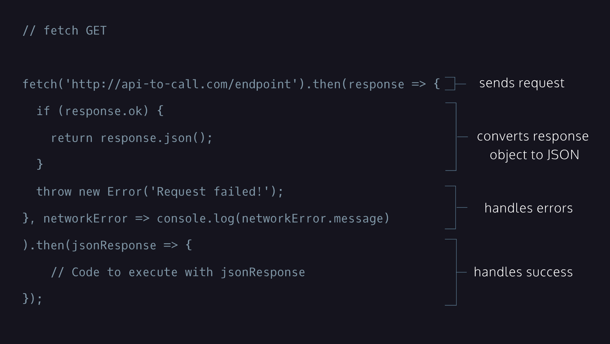
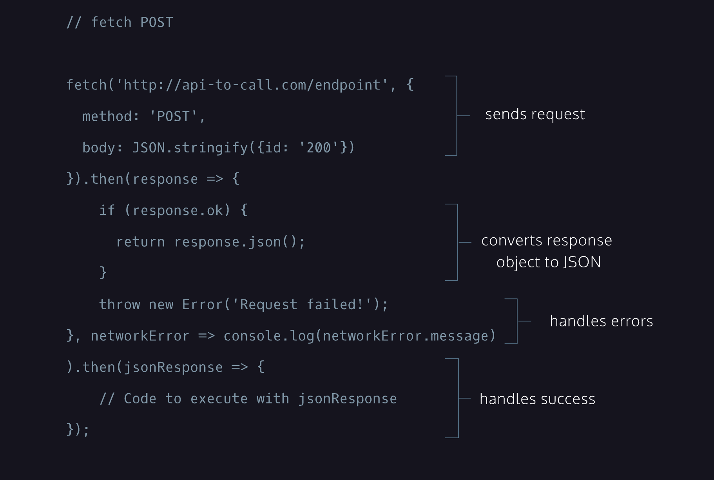

# Javascript
## Table of Contents
- [Commonly Used Method](#commonly-used-method)
- [Data Types](#data-types)
- [Hoisting](#hoisting)
- [Functional Expression](#functional-expression)
- [Arrow Functions](#arrow-functions)
- [Scope](#scope)
- [Array Methods](#array-methods)
- [Functions](#functions)
- [Higher Order Function](#higher-order-function)
- [Arrow Function and this](#arrow-functions-and-this)
- [Getter](#getter)
- [Setter](#setter)
- [Property Value Shorthand](#property-value-shorthand)
- [Destructured Assignment](#destructured-assignment)
- [Classes](#classes)
- [Modules](#modules)
- [Promises](#promises)
- [Async-Await](#async-await)
- [Requests](#requests)
- [setInterval()](#setinterval)
- [setTimeout()](#settimeout)
- [clearInterval()](#clearinterval)
## Commonly Used Method:

`Math.random()` - Generating float number between 0 (inclusive) and 1(exclusive);  
`Math.floor(Math.random()*max)` - Generating Integer between 0 and max-1  
`name = name.toLowerCase()`  
`name = name.toUpperCase()`

 <sub>[back to top](#table-of-contents)</sub>

## Data Types

In JavaScript, there are eight fundamental data types:

- `Number`: Any number, including numbers with decimals: 4, 8, 1516, 23.42.
- BigInt: Any number, greater than 253-1 or less than -(253-1), with n appended to the number: 1234567890123456n.
- `String`: Any grouping of characters on your keyboard (letters, numbers, spaces, symbols, etc.) surrounded by single quotes: ' ... ' or double quotes " ... ", though we prefer single quotes. Some people like to think of string as a fancy word for text.
- `Boolean`: This data type only has two possible values— either true or false (without quotes). It’s helpful to think of booleans as on and off switches or as the answers to a “yes” or “no” question.
- `Null`: This data type represents the intentional absence of a value, and is represented by the keyword null (without quotes).
- `Undefined`: This data type is denoted by the keyword undefined (without quotes). It also represents the absence of a value though it has a different use than null. undefined means that a given value does not exist.
- `Symbol`: A newer feature to the language, symbols are unique identifiers, useful in more complex coding.
- `Object`: Collections of related data.

### The list of falsy values includes:

- `0`
- Empty strings like `""` or `''`
- `null` which represent when there is no value at all
- `undefined` which represent when a declared variable lacks a value
- `NaN`, or Not a Number

<sub>[back to top](#table-of-contents)</sub>

## [Hoisting](https://developer.mozilla.org/en-US/docs/Glossary/Hoisting)

Hoisting feature in JavaScript which allows access to function declarations before they’re defined.

```
greetWorld(); // Output: Hello, World!

function greetWorld() {
  console.log('Hello, World!');
}
```

Notice how hoisting allowed greetWorld() to be called before the greetWorld() function was defined! Since hoisting isn’t considered good practice.

<sub>[back to top](#table-of-contents)</sub>

## Functional Expression

Another way to define a function is to use a function expression. To define a function inside an expression, we can use the function keyword. In a function expression, the function name is usually omitted. A function with no name is called an anonymous function. A function expression is often stored in a variable in order to refer to it.

```
const caluculateArea = function(width, height){
    const area = width * height;
    return area;
}
```

Unlike function declarations, function expressions are not hoisted so they cannot be called before they are defined.

<sub>[back to top](#table-of-contents)</sub>
## Arrow Functions

ES6 introduced arrow function syntax, a shorter way to write functions by using the special “fat arrow” () => notation.

Arrow functions
remove the need to type out the keyword function every time you need to create a function. Instead, you first include the parameters inside the ( ) and then add an arrow => that points to the function body surrounded in { } like this:

```
const rectangleArea = (width, height) => {
  let area = width * height;
  return area;
};
```

<sub>[back to top](#table-of-contents)</sub>

## Scope

- `Scope` refers to where variables can be accessed throughout the program, and is determined by where and how they are declared.
- `Blocks` are statements that exist within curly braces {}.
- `Global scope `refers to the context within which variables are accessible to every part of the program.
- `Global variables` are variables that exist within global scope.
- `Block scope` refers to the context within which variables are accessible only within the block they are defined.
- `Local variables` are variables that exist within block scope.
- `Global namespace` is the space in our code that contains globally scoped information.
- `Scope pollution` is when too many variables exist in a namespace or variable names are reused.

<sub>[back to top](#table-of-contents)</sub>

## Array methods

`push(ele)` - from end  
`pop()` - from end  
`shift()` - from start  
`unshift(ele)` - from start  
`slice(start_index, end_index)` - creating sublist  
`indexOf` : index of particular element ex: groceryList.indexOf('pasta');  
`splice`: To replace subarray with another array.

Array is pass-by-reference in JS.

<sub>[back to top](#table-of-contents)</sub>

## Functions

In JavaScript, functions are first class objects. This means that, like other
objects you’ve encountered, JavaScript functions can have properties and methods.

Since functions are a type of object, they have properties such as .length and .name, and methods such as .toString()

<sub>[back to top](#table-of-contents)</sub>

## Higher Order Function

A higher-order function is a function that either accepts functions as parameters, returns a function, or both! We call functions that get passed in as parameters callback functions. Callback functions get invoked during the execution of the higher-order function.

```
const higherOrderFunc = param => {
  param();
  return `I just invoked ${param.name} as a callback function!`
}

const anotherFunc = () => {
  return 'I\'m being invoked by the higher-order function!';
}

higherOrderFunc(anotherFunc);
```

`.forEach` - loop through the array.  
`.map` - create new array with a new element as per given condition in callback function  
`.filter` - filter the array as per given condition in callback function.  
`.findIndex` - return index of first match.  
`.reduce` - reduce an array to single value as per given condition in callback function.  
`.some` - Check whether at least one element in the array passes the test.  
`.every` - Check whether all element in the array passes the test.

<sub>[back to top](#table-of-contents)</sub>

## Arrow Functions and this

```
const goat = {
  dietType: 'herbivore',
  makeSound() {
    console.log('baaa');
  },
  diet: () => {
    console.log(this.dietType);
  }
};

goat.diet(); // Prints undefined
```

Arrow functions inherently bind, or tie, an already defined this value to the function itself that is NOT the calling object. In the code snippet above, the value of this is the global object, or an object that exists in the global scope, which doesn’t have a dietType property and therefore returns undefined.

`The key takeaway from the example above is to avoid using arrow functions when using this in a method!`

<sub>[back to top](#table-of-contents)</sub>

## Getter

Getter are methods that get and return the internal properties of an object.

```
const person = {
  _firstName: 'John',
  _lastName: 'Doe',
  get fullName() {
    if (this._firstName && this._lastName){
      return `${this._firstName} ${this._lastName}`;
    } else {
      return 'Missing a first name or a last name.';
    }
  }
}

// To call the getter method:
person.fullName; // 'John Doe'
```
<sub>[back to top](#table-of-contents)</sub>

## Setter

Along with getter methods, we can also create setter methods which reassign values of existing properties within an object.

```
const person = {
  _age: 37,
  set age(newAge){
    if (typeof newAge === 'number'){
      this._age = newAge;
    } else {
      console.log('You must assign a number to age');
    }
  }
};
```
<sub>[back to top](#table-of-contents)</sub>

## Property Value Shorthand

Destructuring technique, called property value shorthand, to save ourselves some keystrokes.

```
const monsterFactory = (name, age) => {
  return {
    name,
    age
  }
};
```
<sub>[back to top](#table-of-contents)</sub>

## Destructured Assignment

In destructured assignment we create a variable with the name of an object’s key that is wrapped in curly braces { } and assign to it the object.

```
const vampire = {
  name: 'Dracula',
  residence: 'Transylvania',
  preferences: {
    day: 'stay inside',
    night: 'satisfy appetite'
  }
};

const { residence } = vampire;
console.log(residence); // Prints 'Transylvania'

```
<sub>[back to top](#table-of-contents)</sub>

## Classes

- Classes are templates for objects.
- JavaScript calls a constructor method when we create a new instance of a class.
- Inheritance is when we create a parent class with properties and methods that we can extend to child classes.
- We use the extends keyword to create a subclass.
- The super keyword calls the constructor() of a parent class.
- Static methods are called on the class, but not on instances of the class.

`Parent Class`

```
class HospitalEmployee {
  //Constructor
  constructor(name) {
    this._name = name; //private properties using prefix '_'
    this._remainingVacationDays = 20;
  }

  //Static Method
  static generatePassword(){
    return Math.floor(Math.random()*10000)
  }

  //Getter Method
  get name() {
    return this._name;
  }

  //Getter Method
  get remainingVacationDays() {
    return this._remainingVacationDays;
  }

  //Class Method
  takeVacationDays(daysOff) {
    this._remainingVacationDays -= daysOff;
  }
}
```

`Child Class`

```
//using extend keyword for inheriting parent class.
class Nurse extends HospitalEmployee {

  constructor(name, certifications) {
    //invoking super method for calling parent class constructor
    super(name);
    this._certifications = certifications;
  }

  get certifications() {
    return this._certifications;
  }

  addCertification(newCertification) {
    this.certifications.push(newCertification);
  }
}
```

`Driver Code`

```
//Creating object of Nurse class.
const nurseOlynyk = new Nurse('Olynyk', ['Trauma','Pediatrics']);

//invoking method present inside parent class i.e HospitalEmployee.
nurseOlynyk.takeVacationDays(5);

//invoking getter function.
console.log(nurseOlynyk.remainingVacationDays);

//invoking function present in child class i.e Nurse.
nurseOlynyk.addCertification('Genetics');
console.log(nurseOlynyk.certifications);
```
<sub>[back to top](#table-of-contents)</sub>

## Modules

### [Runtime Environment](https://www.codecademy.com/article/introduction-to-javascript-runtime-environments)

A runtime environment is where your program will be executed. JavaScript code may be executed in one of two runtime environments:

- a browser’s runtime environment
- the Node runtime environment

In each of these environments, different data values and functions are available, and these differences help distinguish front-end applications from back-end applications.

- Front-end JavaScript applications are executed in a browser’s runtime environment and have access to the window object.
- Back-end JavaScript applications are executed in the Node runtime environment and have access to the file system, databases, and networks attached to the server.

### Modules

Modules are reusable pieces of code in a file that can be exported and then imported for use in another file. A modular program is one whose components can be separated, used individually, and recombined to create a complex system.

Example:

```
/* shape-area.js */
const PI = Math.PI;

const circleArea = (radius)=>{
  return PI*radius*radius;
}
const squareArea = (side)=>{
  return side * side;
}
module.exports.circleArea = circleArea;
module.exports.squareArea = squareArea;
```

```
/* app.js */
const {circleArea, squareArea} = require('./shape-area.js');
const radius = 5;
const sideLength = 10;

const areaOfCircle = circleArea(radius);
const areaOfSquare = squareArea(sideLength);
console.log('Circle Area: ', areaOfCircle);
console.log('Square Area: ', areaOfSquare)

```

[Implementing modules using ES6 Syntax](https://www.codecademy.com/article/implementing-modules-using-es-6-syntax)

<sub>[back to top](#table-of-contents)</sub>

## Promises

Promises are objects that represent the eventual outcome of an asynchronous operation. A Promise object can be in one of three states:

- Pending: The initial state— the operation has not completed yet.
- Fulfilled: The operation has completed successfully and the promise now has a resolved value. For example, a request’s promise might resolve with a JSON object as its value.
- Rejected: The operation has failed and the promise has a reason for the failure. This reason is usually an Error of some kind.

### Constructing a Promise Object

```
const executorFunction = (resolve, reject) => {
 if (someCondition) {
     resolve('I resolved!');
 } else {
     reject('I rejected!');
}
const myFirstPromise = new Promise(executorFunction);
```

The Promise constructor method takes a function parameter called the executor function which runs automatically when the constructor is called. The executor function generally starts an asynchronous operation and dictates how the promise should be settled.

The executor function has two function parameters, usually referred to as the resolve() and reject() functions. The resolve() and reject() functions aren’t defined by the programmer. When the Promise constructor runs, JavaScript will pass its own resolve() and reject() functions into the executor function.

- resolve is a function with one argument. Under the hood, if invoked, resolve() will change the promise’s status from pending to fulfilled, and the promise’s resolved value will be set to the argument passed into resolve().

- reject is a function that takes a reason or error as an argument. Under the hood, if invoked, reject() will change the promise’s status from pending to rejected, and the promise’s rejection reason will be set to the argument passed into reject().

```
let prom = new Promise((resolve, reject) => {
  let num = Math.random();
  if (num < .5 ){
    resolve('Yay!');
  } else {
    reject('Ohhh noooo!');
  }
});

//Success Handler
const handleSuccess = (resolvedValue) => {
  console.log(resolvedValue);
};

//Failure Handler
const handleFailure = (rejectionReason) => {
  console.log(rejectionReason);
};

prom.then(handleSuccess, handleFailure);
```

Better way of handling failure cases i.e following separation of concern.

```
prom.then(handleSuccess).catch(handleFailure);
```

### Chaining Multiple Promises

One common pattern we’ll see with asynchronous programming is multiple operations which depend on each other to execute or that must be executed in a certain order. This process of chaining promises together is called composition.

Example:

```
const {checkInventory, processPayment, shipOrder} = require('./library.js');

const order = {
  items: [['sunglasses', 1], ['bags', 2]],
  giftcardBalance: 79.82
};

checkInventory(order)
.then((resolvedValueArray) => {
  return processPayment(resolvedValueArray);
})
.then((resolvedValueArray) => {
  return shipOrder(resolvedValueArray);
})
.then((successMessage) => {
  console.log(successMessage);
})
.catch((errorMessage) => {
  console.log(errorMessage);
});
```

### Avoiding Comman Mistakes while using Promises

`Mistake 1: Nesting promises instead of chaining them`

```returnsFirstPromise()
.then((firstResolveVal) => {
  return returnsSecondValue(firstResolveVal)
    .then((secondResolveVal) => {
      console.log(secondResolveVal);
    })
})
```

<br/>

`Mistake 2: Forgetting to return a promise.`

```
returnsFirstPromise()
.then((firstResolveVal) => {
  returnsSecondValue(firstResolveVal)
})
.then((someVal) => {
  console.log(someVal);
})
```

### Promise.all()

- We need to execute multiple promises which does not depends upon each other, but it's important that all promises should be resolved successfully. So, for concurrent execution of promises we are using promise.all()
- Promise.all() accepts an array of promises as its argument and returns a single promise. That single promise will settle in one of two ways:
- If every promise in the argument array resolves, the single promise returned from Promise.all() will resolve with an array containing the resolve value from each promise in the argument array.
- If any promise from the argument array rejects, the single promise returned from Promise.all() will immediately reject with the reason that promise rejected. This behavior is sometimes referred to as failing fast.

<sub>[back to top](#table-of-contents)</sub>

## Async-Await

### Async

The async keyword is used to write functions that handle asynchronous actions. We wrap our asynchronous logic inside a function prepended with the async keyword. Then, we invoke that function.

async functions always return a promise. This means we can use traditional promise syntax, like .then() and .catch with our async functions. An async function will return in one of three ways:

If there’s nothing returned from the function, it will return a promise with a resolved value of undefined.
If there’s a non-promise value returned from the function, it will return a promise resolved to that value.
If a promise is returned from the function, it will simply return that promise

```
async function fivePromise() {
  return 5;
}

fivePromise()
.then(resolvedValue => {
    console.log(resolvedValue);
  })  // Prints 5

```

In the example above, even though we return 5 inside the function body, what’s actually returned when we invoke fivePromise() is a promise with a resolved value of 5.

### Await

The await keyword can only be used inside an async function. await is an operator: it returns the resolved value of a promise. Since promises resolve in an indeterminate amount of time, await halts, or pauses, the execution of our async function until a given promise is resolved.

```
const brainstormDinner = require('./library.js');

// Native promise version:
function nativePromiseDinner() {
  brainstormDinner().then((meal) => {
	  console.log(`I'm going to make ${meal} for dinner.`);
  });
}

// async/await version:
async function announceDinner() {
    const meal = await brainstormDinner();
    console.log(`I'm going to make ${meal} for dinner.`);
}
announceDinner()
```

Note:  
await keyword halts the execution of an async function until a promise is no longer pending. Don’t forget the await keyword! It may seem obvious, but this can be a tricky mistake to catch because our function will still run— it just won’t have the desired results.

### Handling Errors

With async...await, we use try...catch statements for error handling. By using this syntax, not only are we able to handle errors in the same way we do with synchronous code, but we can also catch both synchronous and asynchronous errors.

```
async function usingTryCatch() {
 try {
   let resolveValue = await asyncFunction('thing that will fail');
   let secondValue = await secondAsyncFunction(resolveValue);
 } catch (err) {
   // Catches any errors in the try block
   console.log(err);
 }
}

usingTryCatch();
```
<sub>[back to top](#table-of-contents)</sub>

## Requests

### `Get Request using Fetch`


### `Post Request using Fetch`


<sub>[back to top](#table-of-contents)</sub>

## setInterval()
`setInterval()` repeatedly executes a function or code snippet, with a fixed time delay between each call. It continues to run until it’s explicitly stopped using clearInterval().

**Syntax:**
```
setInterval(function, delay);
```
**Example:**
```
// Logs "Hello!" to the console every 2 seconds
const intervalId = setInterval(() => {
  console.log("Hello!");
}, 2000);
```

<sub>[back to top](#table-of-contents)</sub>

## setTimeout()
`setTimeout()` executes a function or code snippet once after a specified delay. It only runs the function once after the delay and stops automatically.

**Syntax:**
```
setTimeout(function, delay);
```

**Example:**
```
// Logs "Hello!" to the console after 3 seconds
setTimeout(() => {
  console.log("Hello!");
}, 3000);
```

<sub>[back to top](#table-of-contents)</sub>

## clearInterval()
`clearInterval()` stops an ongoing interval set by `setInterval()` using its ID.

**Syntax:**
```
clearInterval(intervalId);
```
***Example:***
```
// Starts an interval that logs "Hello!" every 2 seconds
const intervalId = setInterval(() => {
  console.log("Hello!");
}, 2000);

// Stops the interval after 10 seconds
setTimeout(() => {
  clearInterval(intervalId);
  console.log("Interval stopped!");
}, 10000);
```
In this example, "Hello!" will be logged every 2 seconds, and after 10 seconds, `clearInterval()` stops the recurring action.

<sub>[back to top](#table-of-contents)</sub>

## Array Sorting | Difference Between `nums.sort()` and `nums.sort((a,b)=>a-b)`

The difference between nums.sort() and nums.sort((a, b) => a - b); lies in how JavaScript's default sort() function handles the comparison of array elements. Here’s a breakdown:

### nums.sort() (Default Sort):
JavaScript's default sort() sorts elements as strings.
This means it uses `lexicographical (dictionary-like) order,` even if the array contains numbers.
For example, [1, 2, 10, 5] sorted with nums.sort() would become [1, 10, 2, 5], because it compares "10" as a string, placing it before "2".

### nums.sort((a, b) => a - b); (Numeric Sort):
Using nums.sort((a, b) => a - b); provides a comparison function that `sorts the elements as numbers`.
Here, (a - b) returns a negative value if a is less than b, a positive value if a is greater than b, and 0 if they are equal.
This numeric comparison function ensures that the array [1, 2, 10, 5] correctly sorts to [1, 2, 5, 10].


## Reduce in JS
Finding common elements in two array.

```
 * @param {number[]} nums1
 * @param {number[]} nums2
 * @return {number[]}
 */

var intersect = function(nums1, nums2) {
    const countMap = nums1.reduce(
        (map, num)=>{
            map.set(num, (map.get(num)||0)+1)
            return map;
        },
        new Map()
    );
    
    return nums2.reduce((res, num)=>{
        if (countMap.get(num)){
            res.push(num);
            countMap.set(num, countMap.get(num)-1);
        }
        return res;
    }, []);
    };
```

## Array(frequency).fill(ele)
This function is used for creating array of length `frequency` having every element equal to `ele`

i.e `Array(3).fill(2)==[2, 2, 2]`